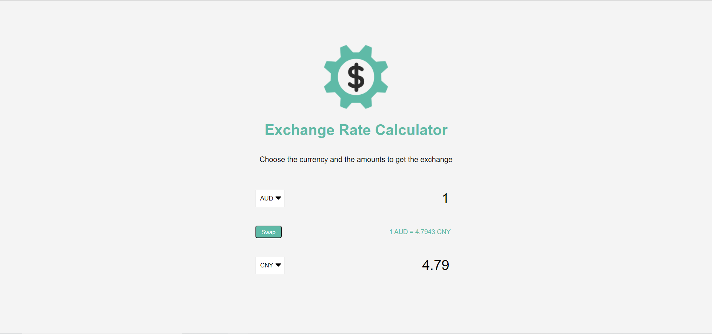

# CurrencyExchangeCalculator

As its name, the application is used for calculate currency amount based on selected currency toward to target currency

##

Below is how the application looks like after implementation
 
 

